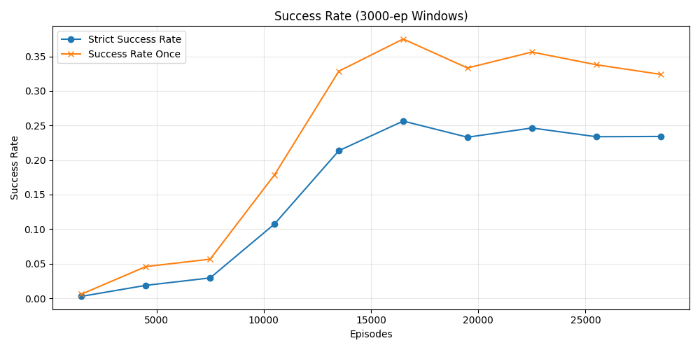
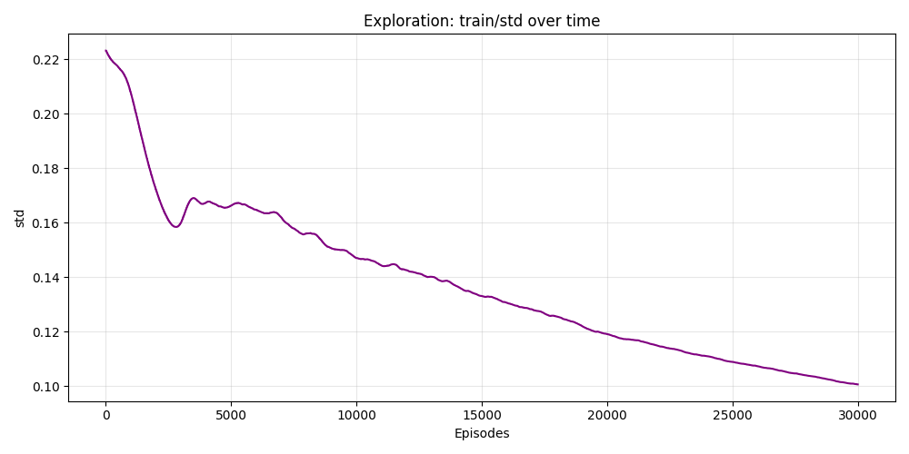
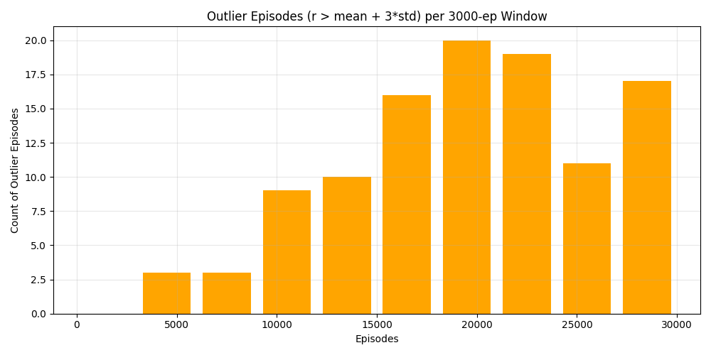

# Run Analysis Report: `reward_ablation_20260905_145804_iew0.3`

## Step 1: Load and Validate
- **`monitor.csv`**: 30,000 episodes, 3,000,000 total timesteps.
- **`progress.csv`**: Max episodes logged 30,000, max timesteps logged 3,000,000.
- The two logs are consistent with each other in both episode count and timestep ranges. No unexpected missing values or NaN gaps were found beyond the standard sparse row logging typical for alternating train/rollout metrics.

## Step 2: Success-Rate Trend & Plateau Analysis
| Window (Episodes) | Mean Success Rate | Mean Success Rate (Once) |
| --- | --- | --- |
| 0-3000 | 0.0027 | 0.0059 |
| 3000-6000 | 0.0186 | 0.0458 |
| 6000-9000 | 0.0294 | 0.0565 |
| 9000-12000 | 0.1074 | 0.1786 |
| 12000-15000 | 0.2135 | 0.3286 |
| 15000-18000 | 0.2564 | 0.3751 |
| 18000-21000 | 0.2330 | 0.3332 |
| 21000-24000 | 0.2464 | 0.3563 |
| 24000-27000 | 0.2338 | 0.3379 |
| 27000-30000 | 0.2341 | 0.3240 |

**Observations:**
- The mean success rate climbs steadily, peaking at 25.6% during the 15k-18k episode window. It then ceases to grow, bouncing in a narrow 23.3% - 24.6% range for the final 12,000 episodes. 
- The `success_rate_once` metric tracks above the strict success rate by a relatively consistent gap (~9-12%) throughout the plateau phase. The gap neither drastically widens nor narrows, indicating that near-misses are occurring at a stable rate.
- **`train/aux_weight`** does not cross below 1.0 during this run (as the run only lasted 3M steps, and decay to <1.0 typically happens at ~4.5M steps).

## Step 3: Exploration (`train/std`) Analysis
- **25% mark** (ep 7,500): `train/std` = 0.1579
- **50% mark** (ep 15,000): `train/std` = 0.1330 *(decay of -0.0249)*
- **75% mark** (ep 22,500): `train/std` = 0.1138 *(decay of -0.0192)*
- **100% mark** (ep 30,000): `train/std` = 0.1006 *(decay of -0.0132)*

**Observations:**
The decay of exploration noise is decelerating. Cross-referencing this against the success rate trend: the success rate plateaus from episode 15,000 onwards while the standard deviation continues to decline from 0.13 to 0.10. Since the policy holds its performance steady rather than collapsing, it indicates some stability, but the fact that it fails to improve as noise drops is somewhat concerning; the agent may be stuck in a local optimum.

## Step 4: Reward Components & Grasp Behavior
Fraction of logged rows per window where the reward component is > 0:

| Window (Episodes) | grasp_reward | goal_reward | static_reward | info_exist_reward |
| --- | --- | --- | --- | --- |
| 0-3000 | 0.2533 | 0.2533 | 0.0000 | 0.9813 |
| 3000-6000 | 0.9360 | 0.9360 | 0.0000 | 1.0000 |
| 6000-9000 | 0.9573 | 0.9573 | 0.0000 | 1.0000 |
| 9000-12000 | 0.9600 | 0.9600 | 0.0000 | 1.0000 |
| 12000-15000 | 0.8560 | 0.8560 | 0.0000 | 1.0000 |
| 15000-18000 | 0.7360 | 0.7360 | 0.0000 | 1.0000 |
| 18000-21000 | 0.7413 | 0.7413 | 0.0000 | 1.0000 |
| 21000-24000 | 0.8000 | 0.8000 | 0.0000 | 1.0000 |
| 24000-27000 | 0.7413 | 0.7413 | 0.0000 | 1.0000 |
| 27000-30000 | 0.6960 | 0.6960 | 0.0000 | 1.0000 |

**Observations:**
- `grasp_reward` and `goal_reward` peak in frequency between episodes 3,000 and 12,000 (reaching ~96%), before slowly declining to ~70% by the end of training. This decline explicitly coincides with the rise in success rate (starting around 12k). As established, this is an expected artifact: successful steps skip shaped sub-rewards, which naturally depresses their logged frequencies as the agent gets better.
- **Outlier Episodes** (Raw `r` from `monitor.csv` > mean + 3·std, threshold: 588.07):
  - 0-3000: 0
  - 3000-6000: 3
  - 6000-9000: 3
  - 9000-12000: 9
  - 12000-15000: 10
  - 15000-18000: 16
  - 18000-21000: 20
  - 21000-24000: 19
  - 24000-27000: 11
  - 27000-30000: 17
  The frequency of high-reward outlier episodes generally increases as training progresses, peaking during the 18k-24k windows, confirming that the policy is producing more genuine grasp-attempts and near-successes as it learns, perfectly tracking the plateau observed in the strict success metrics.

## Step 5: Anomaly Scan
No obvious discontinuities, sign flips, divergence, infinities, or massive spikes were detected across the `train/*` columns (`actor_loss`, `critic_loss`, `ent_coef`, `ent_coef_loss`, etc.). The training dynamics appear smooth and stable.

## Plots

## Conclusion

**Does this run show a genuine plateau, and if so starting around what episode?**
Yes, this run shows a genuine, stable plateau starting around **episode 18,000**. 

The strict success rate hits a peak of 25.6% during the 15k-18k window, and then stubbornly flattens out, registering between 23.3% and 24.6% for the final 12,000 episodes of the run. The `success_rate_once` metric follows this exact same flattened trajectory (hovering steadily between 32% and 35%), proving the plateau is not merely an artifact of strict termination conditions, as the gap between the two metrics remains steady. Additionally, the frequency of high-reward outlier episodes from `monitor.csv` levels off at roughly 15-20 per window during this exact same period. 

Because the exploration noise (`train/std`) continues to smoothly decay throughout this extended plateau without unlocking any further gains in success or outlier frequency, the data trend suggests that **further training is unlikely to help**. The policy appears to have converged to a stable local optimum under its current hyperparameters and reward structure.
